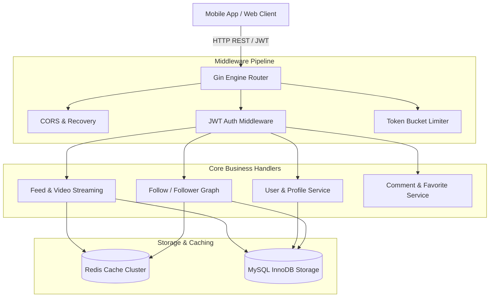

# ⚡ tiktok-backend-go Architecture Blueprint

  <b>English | <a href="./ARCHITECTURE_zh.md">简体中文</a></b>

This document details the high-concurrency video feed, user interaction, and relation graph architecture powering **tiktok-backend-go**.

---

## 🚀 1. Video Feed Caching & Low-Latency Delivery
- Utilizes Redis sorted sets (`ZSET`) keyed by publish timestamp to power sub-millisecond timeline feed pagination.
- Asynchronously increments video view counts and interaction counters with batched Redis flushes to MySQL.

---

## 🔒 2. Relation Graph Transaction Handling
- Atomically updates followings and follower counts within ACID database transactions.
- Employs Redis bitmap & set operations to achieve O(1) mutual-follow relation queries.

---

© 2026 tiktok-backend-go. Licensed under the MIT License.
