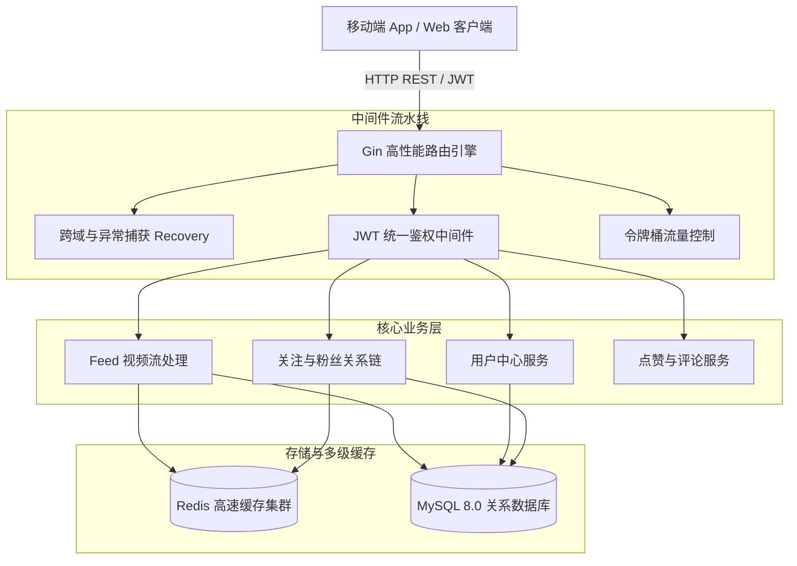

# ⚡ tiktok-backend-go 高并发短视频服务架构设计 (Architecture Guide)

  <b><a href="./ARCHITECTURE.md">English</a> | 简体中文</b>

本文档阐述 **tiktok-backend-go** 在高并发短视频流推送、用户交互与社交关系链场景下的系统架构与优化实践。

---

## 🚀 1. 毫秒级短视频 Feed 流缓存架构
- 借助 Redis `ZSET` 基于发布时间戳维护视频索引流，实现毫秒级分页与滑动窗口查询。
- 点赞与播放计数器在 Redis 中进行高并发自增，并通过后台定时任务批量刷盘至 MySQL。

---

## 🔒 2. 社交关系链事务一致性
- 关注/取关操作采用 MySQL 事务保障粉丝数与关注数双向一致。
- 借助 Redis `SET` 的交集计算实现 O(1) 复杂度的互相关注/好友关系极速判定。

---

© 2026 tiktok-backend-go. Licensed under the MIT License.
