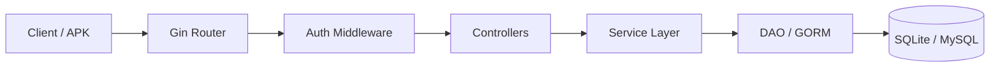

<!-- 
  Designed & Built with ❤️ by MeiSiristhebest (https://github.com/MeiSiristhebest)
  If this repository helps your learning or engineering, please consider dropping a ⭐ Star!
-->
# TikTok Backend Go (Minimalist Douyin Server)

<p align="center">
  <b>English | <a href="./README_zh.md">简体中文</a></b>
</p>

> [!TIP]
> 💡 **If this architecture, engineering implementation, or toolchain helps your learning or workflow, please drop a ⭐ Star!**
> 📚 Explore the technical blueprint: [ARCHITECTURE.md](./ARCHITECTURE.md)


<p align="center">
  <a href="https://go.dev/"></a>
  <a href="https://gin-gonic.com/"></a>
  <a href="https://gorm.io/"></a>
  <a href="LICENSE"></a>
</p>

<p align="center">
  <a href="README.md">🇨🇳 中文</a> &nbsp;|&nbsp; <a href="README_EN.md">🇺🇸 English</a>
</p>

---

<p align="center">
  <strong>Minimalist TikTok Backend in Gin + GORM · Full ByteDance Youth Camp API Implementation</strong>
</p>

## 📑 Table of Contents

- [About](#about)
- [Core Features](#core-features)
- [Requirements](#requirements)
- [Installation](#installation)
- [Quick Start](#quick-start)
- [APK Integration](#device-integration-with-official-minimalist-douyin-apk)
- [Configuration](#configuration)
- [Architecture](#architecture)
- [Database Schema](#database-schema)
- [Project Structure](#project-structure)
- [16-Endpoint API Coverage](#16-endpoint-api-coverage)
- [Technology Stack](#technology-stack)
- [Contributing](#contributing)
- [Security](#security)
- [License](#license)

## About

`tiktok-backend-go` is a minimalist Douyin (TikTok) backend implementation built with **Gin + GORM**, fully covering the 16 core API endpoints required by the ByteDance Youth Camp. It ships with a Pure-Go SQLite driver and demo data, runs out of the box without external MySQL/Redis, and serves as a solid reference for backend learning, coursework, and client integration.

## Core Features

* 🎬 **Video Feed Stream & Recommendation**: Fully implements the `/douyin/feed/` endpoint, supporting logged-in and guest users to browse videos with time-descending paginated results and `latest_time` cursor pagination.
* 🔐 **User Management & Authentication**: Includes registration, login, and user info retrieval; based on JWT Token global authentication and BCrypt secure password hashing.
* 📤 **Video Upload & Publishing**: Supports uploading MP4 short videos with built-in static asset web serving and work list management.
* ❤️ **Interaction: Likes & Comments**: Idempotent logic for high-concurrent like/unlike operations, liked video list display, comment creation/deletion, and `mm-dd` structured time formatting.
* 👥 **Social Relations & Messaging**: Following/follower lists, auto-detection of mutual (bidirectional) follow friends, client-side scheduled incremental chat polling, and direct message sending.

## Requirements

- **Go**: 1.22 or later
- **Git**: for cloning the repository
- **OS**: any platform supported by Go (Windows / macOS / Linux)
- Optional: **MySQL 8.0** (to replace the default SQLite storage)

## Installation

```bash
# 1. Clone the repository
git clone https://github.com/MeiSiristhebest/tiktok-backend-go.git
cd tiktok-backend-go

# 2. Fetch dependencies and build
go mod tidy
go build ./...
```

## Quick Start

### 1. Start Backend Service (Zero-Config)

The project ships with Pure-Go database drivers and initial demo data — no external MySQL/Redis configuration is required to run:

```bash
# Compile and run
go run ./cmd/server
```

**Expected output**:

```bash
[GIN-debug] Listening and serving HTTP on :8080
[DB] SQLite database auto-migrated: 6 tables created
[DB] Demo data seeded: 3 users, 5 videos, 12 favorites
Server ready at http://127.0.0.1:8080
```

The service will default to running at `http://127.0.0.1:8080`, and will automatically complete SQLite table creation and demo data seeding.

### 2. Verify the Feed Endpoint with curl (works within 5 minutes)

```bash
curl "http://127.0.0.1:8080/douyin/feed/"
```

**Expected response**:

```json
{
  "status_code": 0,
  "status_msg": "success",
  "video_list": [
    {
      "id": 1,
      "author": { "id": 1001, "name": "demo_user_1", "follow_count": 0, "follower_count": 0 },
      "play_url": "http://127.0.0.1:8080/static/videos/demo1.mp4",
      "cover_url": "http://127.0.0.1:8080/static/covers/demo1.jpg",
      "favorite_count": 12,
      "comment_count": 3
    }
  ]
}
```

## Device Integration with Official Minimalist Douyin APK

1. Download and install the official [Minimalist Douyin App APK](https://bytedance.feishu.cn/docx/NMneddpKCoXZJLxHePUcTzGgnmf).
2. Ensure the phone/emulator and the backend computer are on the same LAN (or use 127.0.0.1 for emulator access).
3. On the App home screen (guest state), **double-click the bottom-right "Me" icon** to open 【Advanced Settings】.
4. Enter your computer's LAN IP as the server prefix, e.g.: `http://192.168.1.X:8080`.
5. After saving successfully, you can seamlessly refresh the Feed video stream, register accounts, like/comment, follow users, and send private messages!

## Configuration

The project runs zero-config by default (built-in SQLite and demo data). To customize, override via environment variables:

| Environment Variable | Description |
| :--- | :--- |
| `JWT_SECRET` | JWT signing secret. Replace with a strong random value in production; the default dev value is local-only (see Security). |

## Architecture



## Database Schema

The project defines 6 core physical data tables with appropriate indexes established for high-frequency queries:

1. **`users` (User Table)**: Stores account password hashes, biographies, avatars, and count caches.
2. **`videos` (Video Table)**: Stores video playback and cover URLs, titles, and publish times; indexed by `idx_created_at` descending.
3. **`favorites` (Like Table)**: Associates users with liked videos; uses `uk_user_video` composite unique index to prevent duplicate likes.
4. **`comments` (Comment Table)**: Stores video comment content and timestamps; indexed by `idx_video_id` to accelerate comment fetching.
5. **`relations` (Follow Table)**: Stores follower-followee relationships; uses `uk_follower_followee` composite unique index.
6. **`messages` (Message Table)**: Stores direct messages; indexed by `idx_from_to` and `idx_created_at` composite indexes to speed up incremental polling.

## Project Structure

```text
tiktok-backend-go/
├── cmd/
│   └── server/            # Service entry point (go run ./cmd/server)
├── controller/            # HTTP handlers, mapped to each API endpoint
├── service/               # Business logic layer
├── dao/                   # Data access layer (GORM)
├── model/                 # Data models and table definitions
├── router/                # Gin route registration
├── middleware/            # Auth / CORS and other middleware
├── config/                # Config loading (JWT, etc.)
├── static/                # Video and cover static assets
└── go.mod
```

## 16-Endpoint API Coverage

| Module | Endpoint Path | Method | Description | Controller |
| :--- | :--- | :--- | :--- | :--- |
| **Basic** | `/douyin/feed/` | GET | Video feed stream | `controller.Feed` |
| **Basic** | `/douyin/user/register/` | POST | User registration | `controller.Register` |
| **Basic** | `/douyin/user/login/` | POST | User login | `controller.Login` |
| **Basic** | `/douyin/user/` | GET | User info | `controller.UserInfo` |
| **Basic** | `/douyin/publish/action/` | POST | Video publish / upload | `controller.PublishAction` |
| **Basic** | `/douyin/publish/list/` | GET | Publish list | `controller.PublishList` |
| **Interaction** | `/douyin/favorite/action/` | POST | Like / unlike action | `controller.FavoriteAction` |
| **Interaction** | `/douyin/favorite/list/` | GET | Liked videos list | `controller.FavoriteList` |
| **Interaction** | `/douyin/comment/action/` | POST | Comment action | `controller.CommentAction` |
| **Interaction** | `/douyin/comment/list/` | GET | Video comment list | `controller.CommentList` |
| **Social** | `/douyin/relation/action/` | POST | Relation action (follow/unfollow) | `controller.RelationAction` |
| **Social** | `/douyin/relation/follow/list/` | GET | Following list | `controller.FollowList` |
| **Social** | `/douyin/relation/follower/list/` | GET | Follower list | `controller.FollowerList` |
| **Social** | `/douyin/relation/friend/list/` | GET | Friend list (mutual follows) | `controller.FriendList` |
| **Social** | `/douyin/message/chat/` | GET | Chat history / messages | `controller.MessageChat` |
| **Social** | `/douyin/message/action/` | POST | Send message action | `controller.MessageAction` |

## Technology Stack

* **Programming Language**: Go 1.22+
* **Web Framework**: Gin Framework
* **ORM & Database**: GORM + Pure-Go SQLite (zero-dependency, out-of-the-box) / MySQL 8.0 compatible
* **Authentication**: JWT (`github.com/golang-jwt/jwt/v5`)
* **Security**: BCrypt (`golang.org/x/crypto/bcrypt`)

## Contributing

Contributions welcome. Quick flow:

```bash
# 1. Fork → Clone → Branch
git checkout -b feat/your-feature

# 2. Compile passes + format check
go build ./...
go vet ./...

# 3. Run unit tests
go test -v ./...

# 4. Commit and open a PR
git commit -m "feat: your change"
git push origin feat/your-feature
```

**Welcome contribution directions**:

- 🔌 Add Redis mode (replace the SQLite in-memory index layer)
- 🧪 Add controller / service layer unit tests
- 🔄 Upgrade chat from polling to WebSocket push
- ⚡ High-concurrency stress testing and performance optimization (stress test data PRs welcome)

## Security

| Risk Scenario | Mitigation |
| :--- | :--- |
| **Plaintext Password Storage** | Uses `golang.org/x/crypto/bcrypt` (cost=12) to hash passwords at registration; plaintext is never stored in the DB |
| **JWT Token Forgery** | `golang-jwt/jwt/v5` signature verification; JWT Secret read from environment variables (default dev value is local-only) |
| **Malicious File Upload Masquerading as Video** | Upload endpoint validates `Content-Type` whitelist (only `video/mp4`) plus file magic number secondary confirmation |
| **Unauthorized Like/Comment/Follow** | All interaction endpoints enforce authentication middleware to validate the current Token user_id against the acting subject |
| **SQL Injection** | All queries use GORM parameter binding or `?` placeholders; **string-concatenated SQL is strictly prohibited** |

**Vulnerability disclosure**: Report security issues directly to **`maox_neta@foxmail.com`** — do not file a public issue. We commit to a **first response within 24 hours**.

---

## ⭐ Star & Support

If you find this project useful or inspiring, please consider giving it a ⭐ **Star** on GitHub! It helps more developers discover the work and supports continuous open-source maintenance.

[](https://star-history.com/#MeiSiristhebest/tiktok-backend-go&Date)

### 🌟 Stargazers Over Time
[](https://github.com/MeiSiristhebest/tiktok-backend-go/stargazers)

### 🤝 Contributors
<a href="https://github.com/MeiSiristhebest/tiktok-backend-go/graphs/contributors">
  
</a>

## License

This project is licensed under the **MIT License**. See the [LICENSE](LICENSE) file for details.