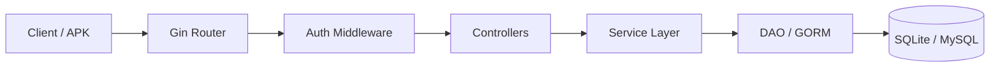

# TikTok Backend Go（极简版抖音服务端）

<p align="center">
  <a href="https://golang.org"></a>
  <a href="https://gin-gonic.com"></a>
  <a href="https://gorm.io"></a>
  <a href="LICENSE"></a>
</p>

<p align="center">
  <a href="README.md">🇨🇳 中文</a> &nbsp;|&nbsp; <a href="README_EN.md">🇺🇸 English</a>
</p>

---

<p align="center">
  <strong>基于 Gin + GORM 的极简版抖音服务端 · 青训营全接口实现</strong>
</p>

## 📑 目录 (Table of Contents)

- [项目简介](#项目简介-about)
- [核心特性](#核心特性-features)
- [环境要求](#环境要求-requirements)
- [安装](#安装-installation)
- [快速开始](#快速开始-quick-start)
- [APK 联调](#与极简抖音-apk-客户端实机联调)
- [配置](#配置-configuration)
- [架构设计](#架构设计-architecture)
- [数据库架构设计](#数据库架构设计-database-schema)
- [项目结构](#项目结构-project-structure)
- [16 个 API 接口覆盖清单](#16-个-api-接口覆盖清单)
- [技术选型](#技术选型-tech-stack)
- [参与贡献](#参与贡献-contributing)
- [安全说明](#安全说明-security)
- [许可协议](#许可协议-license)

## 项目简介 (About)

`tiktok-backend-go` 是一个基于 **Gin + GORM** 的极简版抖音（Douyin）服务端实现，完整覆盖字节青训营要求的 16 个核心 API 接口。项目内置 Pure-Go SQLite 驱动与演示数据，开箱即跑，无需依赖外部 MySQL/Redis，适合作为后端学习、课程作业与客户端联调的参考实现。

## 核心特性 (Features)

* 🎬 **视频 Feed 流与推荐**：全量实现 `/douyin/feed/` 接口，支持未登录/登录用户刷视频，按投稿时间倒序推出的限制分页与 `latest_time` 翻页。
* 🔐 **用户与鉴权**：包含注册、登录与用户信息拉取，基于 JWT Token 全局鉴权与 BCrypt 密码安全哈希存储。
* 📤 **视频投稿与播放**：支持上传 MP4 短视频，内置静态资源 Web 服务与作品列表管理。
* ❤️ **互动点赞与评论**：高并发点赞/取消点赞幂等逻辑、喜欢（点赞）视频列表展示、评论发表/删除及 `mm-dd` 结构化时间显示。
* 👥 **社交关系链与聊天**：关注/粉丝列表、好友（双向关注）自动化判别，客户端定时轮询增量聊天记录与私信发送。

## 环境要求 (Requirements)

- **Go**：1.22 或更高版本
- **Git**：用于克隆仓库
- **操作系统**：任意支持 Go 的平台（Windows / macOS / Linux）
- 可选：**MySQL 8.0**（如需替换默认 SQLite 存储）

## 安装 (Installation)

```bash
# 1. 克隆仓库
git clone https://github.com/MeiSiristhebest/tiktok-backend-go.git
cd tiktok-backend-go

# 2. 下载依赖并编译
go mod tidy
go build ./...
```

## 快速开始 (Quick Start)

### 1. 启动后端服务 (Zero-Config)

项目内置 Pure-Go 数据库驱动与初始测试数据，无需额外配置 MySQL/Redis 即可直接运行：

```bash
# 编译并运行
go run ./cmd/server
```

**预期输出**：

```bash
[GIN-debug] Listening and serving HTTP on :8080
[DB] SQLite database auto-migrated: 6 tables created
[DB] Demo data seeded: 3 users, 5 videos, 12 favorites
Server ready at http://127.0.0.1:8080
```

服务启动后将默认运行在 `http://127.0.0.1:8080`，并自动完成 SQLite 数据库建表与演示数据填充。

### 2. 用 curl 验证 Feed 接口（5 分钟内见效果）

```bash
curl "http://127.0.0.1:8080/douyin/feed/"
```

**预期响应**：

```json
{
  "status_code": 0,
  "status_msg": "success",
  "video_list": [
    {
      "id": 1,
      "author": { "id": 1001, "name": "demo_user_1", "follow_count": 0, "follower_count": 0 },
      "play_url": "http://127.0.0.1:8080/static/videos/demo1.mp4",
      "cover_url": "http://127.0.0.1:8080/static/covers/demo1.jpg",
      "favorite_count": 12,
      "comment_count": 3
    }
  ]
}
```

## 与极简抖音 APK 客户端实机联调

1. 下载并安装官方 [极简抖音 App APK](https://bytedance.feishu.cn/docx/NMneddpKCoXZJLxHePUcTzGgnmf)。
2. 保证手机/模拟器与运行后端的电脑处于同一局域网（或使用 127.0.0.1 模拟器访问）。
3. 打开 App 首页，未登录状态下**双击右下角 "我"** 打开【高级设置】。
4. 在服务器前缀中填入你的电脑 IP，例如：`http://192.168.1.X:8080`。
5. 成功保存后即可顺畅刷新 Feed 视频流、注册账号、点赞评论、关注与发送私信！

## 配置 (Configuration)

项目默认零配置即可运行（使用内置 SQLite 与演示数据）。如需自定义，可通过环境变量覆盖：

| 环境变量 | 说明 |
| :--- | :--- |
| `JWT_SECRET` | JWT 签名密钥。生产环境务必替换为强随机值；默认开发值仅限本地使用（详见安全说明）。 |

## 架构设计 (Architecture)



## 数据库架构设计 (Database Schema)

项目设计了 6 张物理核心数据表，并针对高频查询建立了合理的索引：

1. **`users`（用户表）**：保存账号密码哈希、个性签名、头像及统计基数。
2. **`videos`（视频表）**：保存视频播放与封面 URL、标题及发布时间，建有 `idx_created_at` 倒序索引。
3. **`favorites`（点赞表）**：用户与视频的点赞关联，建立 `uk_user_video` 联合唯一索引防止重复点赞。
4. **`comments`（评论表）**：视频评论内容及时间，建有 `idx_video_id` 提高评论拉取速度。
5. **`relations`（关注表）**：粉丝与被关注者关系，建立 `uk_follower_followee` 联合唯一索引。
6. **`messages`（消息表）**：私信记录，建有 `idx_from_to` 及 `idx_created_at` 复合索引加速增量轮询。

## 项目结构 (Project Structure)

```text
tiktok-backend-go/
├── cmd/
│   └── server/            # 服务入口（go run ./cmd/server）
├── controller/            # HTTP 处理器，对应各 API 接口
├── service/               # 业务逻辑层
├── dao/                   # 数据访问层（GORM）
├── model/                 # 数据模型与表结构定义
├── router/                # Gin 路由注册
├── middleware/            # 鉴权 / 跨域等中间件
├── config/                # 配置加载（JWT 等）
├── static/                # 视频与封面静态资源
└── go.mod
```

## 16 个 API 接口覆盖清单

| 模块 | 接口路径 | 类型 | 说明 | 对应 Controller |
| :--- | :--- | :--- | :--- | :--- |
| **基础** | `/douyin/feed/` | GET | 视频流接口 | `controller.Feed` |
| **基础** | `/douyin/user/register/` | POST | 用户注册 | `controller.Register` |
| **基础** | `/douyin/user/login/` | POST | 用户登录 | `controller.Login` |
| **基础** | `/douyin/user/` | GET | 用户信息 | `controller.UserInfo` |
| **基础** | `/douyin/publish/action/` | POST | 视频投稿 | `controller.PublishAction` |
| **基础** | `/douyin/publish/list/` | GET | 发布列表 | `controller.PublishList` |
| **互动** | `/douyin/favorite/action/` | POST | 赞操作 | `controller.FavoriteAction` |
| **互动** | `/douyin/favorite/list/` | GET | 喜欢列表 | `controller.FavoriteList` |
| **互动** | `/douyin/comment/action/` | POST | 评论操作 | `controller.CommentAction` |
| **互动** | `/douyin/comment/list/` | GET | 视频评论列表 | `controller.CommentList` |
| **社交** | `/douyin/relation/action/` | POST | 关系操作（关注/取关） | `controller.RelationAction` |
| **社交** | `/douyin/relation/follow/list/` | GET | 关注列表 | `controller.FollowList` |
| **社交** | `/douyin/relation/follower/list/` | GET | 粉丝列表 | `controller.FollowerList` |
| **社交** | `/douyin/relation/friend/list/` | GET | 好友列表（互相关注） | `controller.FriendList` |
| **社交** | `/douyin/message/chat/` | GET | 聊天记录 | `controller.MessageChat` |
| **社交** | `/douyin/message/action/` | POST | 消息操作 | `controller.MessageAction` |

## 技术选型 (Tech Stack)

* **编程语言**：Go 1.22+
* **Web 框架**：Gin Framework
* **ORM 与数据库**：GORM + Pure-Go SQLite（零依赖开箱即用）/ MySQL 8.0 兼容
* **鉴权**：JWT（`github.com/golang-jwt/jwt/v5`）
* **安全**：BCrypt（`golang.org/x/crypto/bcrypt`）

## 参与贡献 (Contributing)

欢迎贡献代码。简要流程：

```bash
# 1. Fork → Clone → 切分支
git checkout -b feat/your-feature

# 2. 编译通过 + 格式检查
go build ./...
go vet ./...

# 3. 运行单元测试
go test -v ./...

# 4. Commit 并提 PR
git commit -m "feat: your change"
git push origin feat/your-feature
```

**欢迎贡献的方向**：

- 🔌 新增 Redis 模式（替换 SQLite 内存索引层）
- 🧪 补全 controller / service 层单元测试
- 🔄 聊天从轮询升级为 WebSocket 推送
- ⚡ 高并发压测与性能优化（压测数据欢迎提交 PR）

## 安全说明 (Security)

| 风险场景 | 防护措施 |
| :--- | :--- |
| **密码明文存储** | 注册时使用 `golang.org/x/crypto/bcrypt`（cost=12）对密码哈希，DB 中永不存储明文 |
| **JWT Token 伪造** | `golang-jwt/jwt/v5` 签名校验；JWT Secret 从环境变量读取（默认开发值仅本地可用） |
| **上传恶意文件伪装视频** | 上传接口校验 `Content-Type` 白名单（仅 `video/mp4`）+ 文件头魔数二次确认 |
| **越权点赞/评论/关注** | 所有互动接口强制鉴权中间件校验当前 Token user_id，与操作主体一致 |
| **SQL 注入** | 所有查询通过 GORM 参数绑定或 `?` 占位符，**禁止字符串拼接 SQL** |

**漏洞上报**：发现安全问题请直接发邮件至 **`maox_neta@foxmail.com`**，不要公开在 Issue 里。承诺 **24 小时内首次响应**。

## 许可协议 (License)

本项目基于 **MIT License** 开源协议。详见 [LICENSE](LICENSE) 文件。